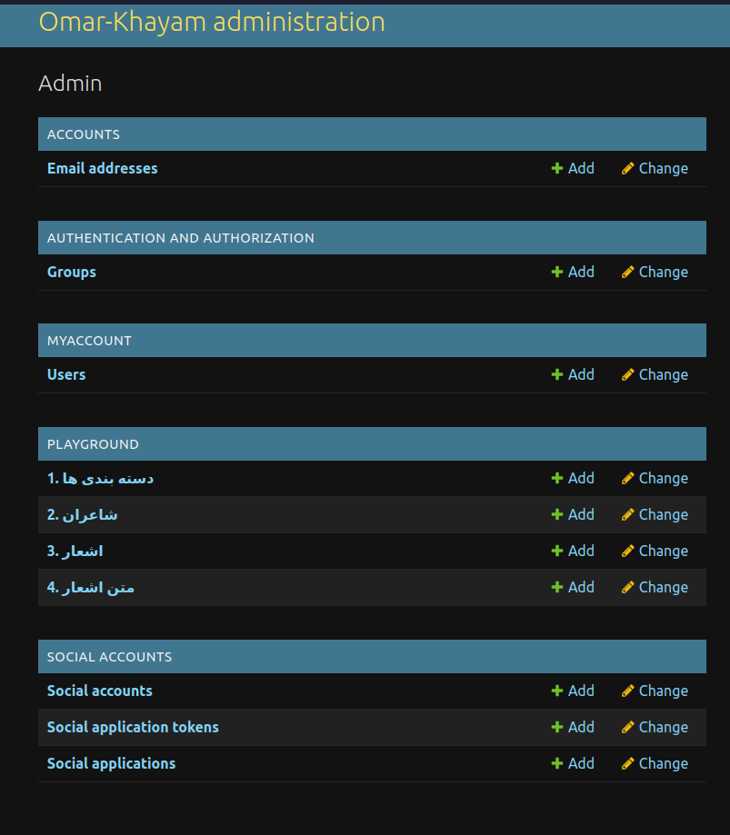
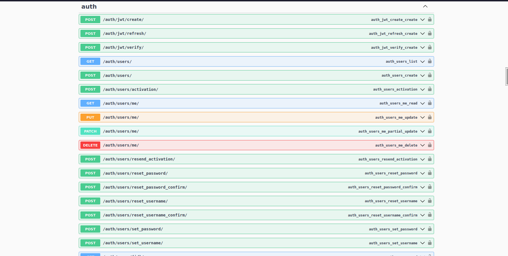
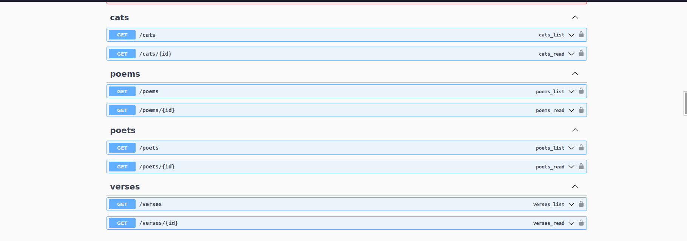
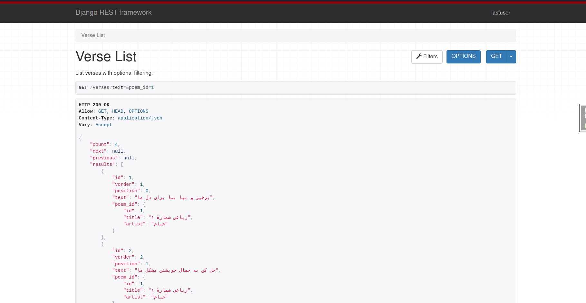

# literature_project

literature_project(Back-end) is a RESTful Store build with Django and Django Rest Framework.


## Installation

Clone the project:

```bash
    git clone https://github.com/MahdiAbbasi7/Storefront.git
```
Please activate your virtual environment before running the project and enter the required information, I recommend pipenv.

## Technologies used

- Python 3.10 - Programming Language
- Django - Web Framework
- Django Rest Framework - For Building RESTful APIs
- Sqlite - Database
- Git - Version Control System
- drf-yasg - Document
- all-oauth - OAuth (Google)








